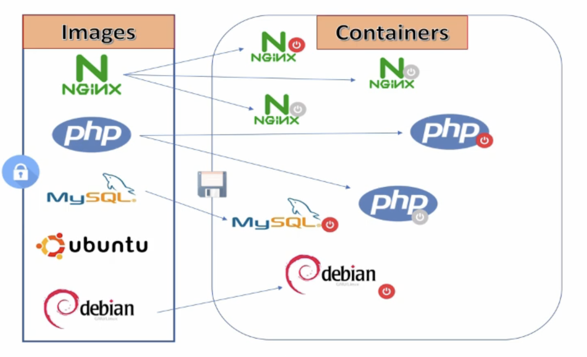

## **List all the images in docker host**
> docker images
## **Search images on docker hub**
> docker search ubuntu
## **Pull image to local docker host**
> docker pull ubuntu:18.04 
> docker pull ubuntu:latest (`or` docker pull ubuntu)
## **Remove an image from docker host**
> docker image rm (id|name) (id can be 2 starting characters, e.g: ubuntu:18.04)