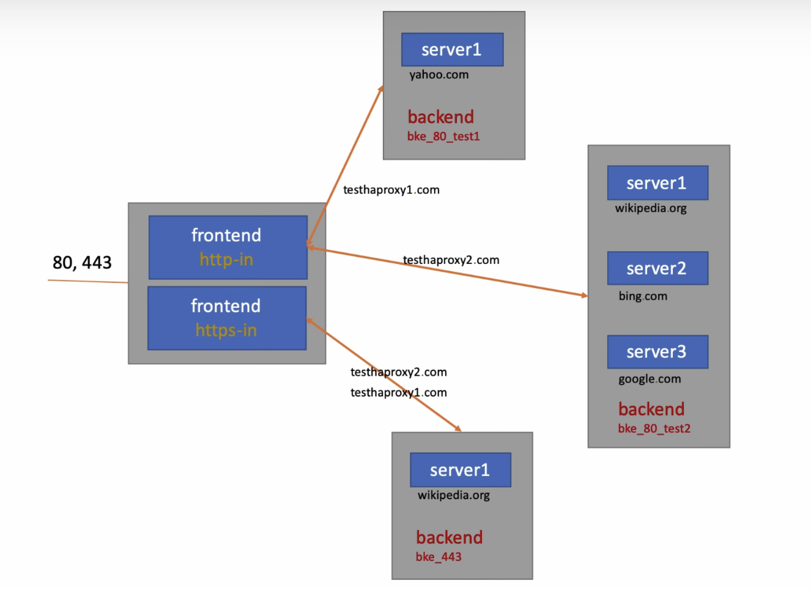

## **Pull HAproxy image**
> docker pull haproxy 
> Create haproxy.cfg file 
> Load Balancing Algorithms: roundrobin (each server in round), leastconn (server with least connection), source (server based on user's IP)
## **Create HAProxy container**
> docker run -v \`pwd\`/haproxy.cfg:/usr/local/etc/haproxy/haproxy.cfg -p 8080:80 -p 443:443 haproxy:latest 
> Update /etc/hosts for virtual domain 
> 127.0.0.1 testhaproxy1.com 
> 127.0.0.1 testhaproxy2.com 
> http on: http://testhaproxy1.com:8080, http://testhaproxy2.com:8080 
> https on: https://testhaproxy1.com, https://testhaproxy2.com