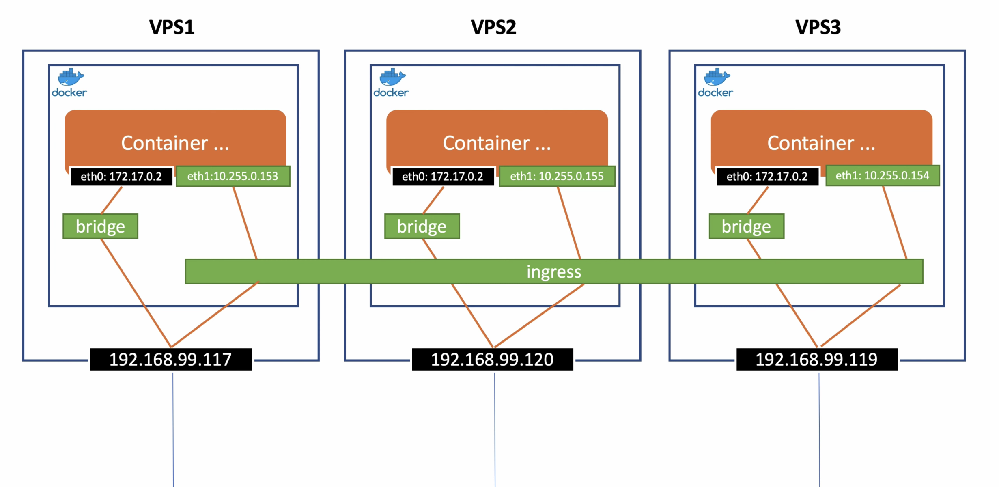

## **Use multiple docker machines as a cluster**
> Must have a manager node that has swarm mode enabled 
> All others node that joined to manager node are worker nodes 
> All nodes including: manager, worker together is called Swarm Cluster 
## **Login to all docker machines**
> docker-machine ssh vps1 
> docker-machine ssh vps2 
> docker-machine ssh vps3 
> docker-machine ls (to show all the IPs)
## **Indicate manager node for vps1**
> docker swarm init --advertise-addr=192.168.99.117 
> docker node ls `(show all nodes joined)` 
> docker swarm join-token worker `(to get the token to join)`
## **Join to a manager node for vps2 vps3**
> docker swarm join --token *token* 192.168.99.117:2377
## **Some commands**
> docker swarm leave `(leave swarm from node worker)` 
> docker node rm (id|name) `(from manager node to remove a node)` 
> stop a docker machine will cause the node in swarm mode to be `Down`
## **Create apps on docker machines**
> Create node app and build an image and push to Docker Hub 
> cd swarm/node 
> docker build -t hwebz/swarmtest:node -f Dockerfile . 
> docker push hwebz/swarmtest:node 
> cd swarm/dotnet 
> docker build -t hwebz/swarmtest:dotnet -f Dockerfile . 
> docker push hwebz/swarmtest:dotnet 
> cd swarm/php 
> docker build -t hwebz/swarmtest:php -f Dockerfile . 
> docker push hwebz/swarmtest:php
## **Create service on docker swarm (manager node)**
> docker service create --replicas 5 -p 8085:8085 --name testservice hwebz/swarmtest:node 
> docker service ls 
> docker service ps testservice 
> docker service logs testsrevice 
> docker stats 
> If you force to remove any container in any docker machine then docker swarm will automatically re-create a new container for deleted one 
> docker service scale testservice=10 `(Scale a service up or down by number of replications)`
> docker service update --image=hwebz/swarmtest:dotnet testservice 
> docker service update --limit-cpu 0.5 --limit-memory 100M testservice
## **Overlay network in docker swarm**
> When create a new service, if you don't expose or map port for container then default network is "bridge" in swarm 
> otherwise, default network is "overlay"
## **Create overlay network on manager node**
> docker network create -d overlay mynetwork1
## **Create service and connect to mynetwork1**
> docker service create --replicas 3 --name myservice -p 8080:80 --network mynetwork1 busybox top 
> You can ping other contains from a container in any node `(docker exec (id|name) ping (other id|name))` 
> Overlay network can't attached in a single container (must be multiple containers in a swarm mode) 
> Otherwise, we can attach to a single container by creating mynetwork2 `(docker network create -d overlay --attachable mynetwork2)` 
> Using docker-compose.yml in swarm/ to define overlay network 
> docker stack deploy -c docker-compose.yml testservice1 
> docker stack rm testservice1
## **Volumes in docker swarm**
> Local volumes can share data between containers in a host only, different hosts are not allowed 
> - SMB file server using Samba [sambar.org](samba.org) 
> - Create smb.conf, docker-entrypoint.sh and Dockerfile in samba/
> - cd samba/ 
> - docker build -t hwebz/samba -f Dockerfile . 
> - docker push hwebz/samba 
> - Define samba service in swarm/docker-compose.yml file 
> - Define volume 2 using type = cifs for sharing /data folder 
> - cd ../swarm 
> - docker stack deploy -c docker-compose.yml testservice1 
> - Access any containers in testservice1 and try to create, update, delete files or folders inside /d2/ then all the /d2/ in all containers are gonna share the same data 
> Create SSH server 
> - cd ssh-server/ 
> - docker build -t hwebz/sshserver -f Dockerfile . 
> - docker push hwebz/sshserver 
> - Define sshd service in swarm/docker-compose.yml file 
> - Install plugin for ssh protocal: `docker plugin install --grant-all-permissions vieux/sshfs` for all docker machines (vps1, vps2, vps3) 
> - Define volume 3 using type = vieux/sshfs for sharing /data folder 
> - cd ../swarm 
> - docker stack deploy -c docker-compose.yml testservice1 
> - Access any containers in testservice1 and try to create, update, delete files or folders inside /d3/ then all the /d3/ in all containers are gonna share the same data 